# EE538 TrojanMap Report 
    Jen-Ting Chang

---
## Overview

When initialized, the program constructs a class called `TrojanMap` which has a member called `data`. 
This member is used to store information from the `data.csv` file.  
The `data` member is constructed using the `Node` class which includes information about server locations. 
Additionally, the program creates a `trie` data structure to store the names of locations. 
Overall, the `TrojanMap` class is responsible for managing the data and providing server functions.

Additionally, I create dynamic and animated UI using ncurses for all functions.

```cpp
class Node {
    public:

        Node(){};
        Node(const Node &n) {
            id = n.id;
            lat = n.lat;
            lon = n.lon;
            name = n.name;
            neighbors = n.neighbors;
            attributes = n.attributes;
        };
        std::string id;    // A unique id assigned to each point.
        double lat;        // Latitude
        double lon;        // Longitude
        std::string name;  // Name of the location. E.g. "Bank of America".
        std::vector<std::string> neighbors;  // List of the ids of all neighbor points.
        std::unordered_set<std::string> attributes;  // List of the attributes of the location.

    class TrojanMap {
    public:
        // Constructor
        TrojanMap() { 

            CreateGraphFromCSVFile();
            buildTrie();
        };

    private:
        struct trieNode{

            char data;
            std::unordered_map< char, trieNode*> mp;
            bool isEnd = false;

        };
        std::unordered_map<std::string, Node> data;
        trieNode* trie  = nullptr;
    }

};

```
---
### Item 1 Autocomplete The Location Name

    After users type in a prefix, the program uses a trie data structure to find a word that matches the given prefix. 

#### Time complexity
    
    O(n), where n is the length of the word being searched.


#### Output
```shell

**************************************************************
* 1. Autocomplete                                             
**************************************************************

Please input a partial location:Tar
*************************Results******************************
Target
**************************************************************
Time taken by function: 0 ms

```
---
### Item 2-1 Find the place's coordinates in the Map

When the function `GetPosition` is called, it takes a name as input and searches through all the locations in the data member to find a location with a matching name. 
Once the location is found, the function retrieves the `Node` member `latitude` and `longitude` information associated with that location. 
Finally, the function returns a `pair` object containing the latitude and longitude values.

#### Time complexity

O(n), where n is the number of data.

#### Output
```shell

**************************************************************
* 2. Find the location                                        
**************************************************************

Please input a location:Ralphs
*************************Results******************************
Latitude: 34.0318 Longitude: -118.291
**************************************************************
Time taken by function: 36 ms

```
---
### Item 2-2 Check Edit Distance Between Two Location Names

The CalculateEditDistance function takes two names, `a` and `b`, as input and calculates the minimum number of edit operations required to transform a into `b`. 
The function uses dynamic programming to efficiently calculate the edit distance in a bottom-up manner.

For each pair of characters in `a` and `b`, the function considers three possible operations: insertion, deletion, or substitution. 
By selecting the operation with the minimum number of steps, the function constructs a table to store the minimum edit distance between each pair of characters.

To calculate the final edit distance between `a` and `b`, the function iteratively considers substrings of `a` and `b`, starting from the beginning of both strings. 
The edit distance between each pair of substrings is calculated by referencing the table constructed earlier. 
By adding the minimum edit distance between the substrings to the overall edit distance, the function eventually arrives at the minimum edit distance between `a` and `b`.

For instance, suppose we want to calculate the edit distance between "horse" and "rose". 
To begin with, the function compares the first characters of each name, "h" and "r". 
It considers all possible ways to transform "h" into "r", which are: inserting "r" and deleting "h" in "2" steps, deleting "h" and inserting "r" in "2" steps, or replacing "h" with "r" in "1" step. 
Since the last option is the cheapest, the function stores the minimum edit distance between "h" and "r" as "1".

Next, the function moves on to compare the first two characters of each name, "ho" and "ro". 
Since the second character of each name, "o", is the same, the function only needs to consider the minimum edit distance required to transform "h" into "r", which was previously calculated as "1". 
Therefore, the function stores the minimum edit distance between "ho" and "ro" as 1.

The function continues in this way, comparing substrings of the input names and referencing the previously calculated minimum edit distances to determine the overall minimum edit distance between the two names. 
By the end of the process, the function will have computed the minimum edit distance between "horse" and "ros", which is equal to "3".

<p align="center">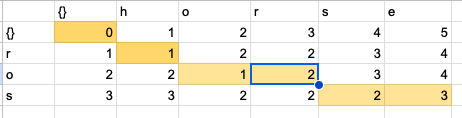</p>


#### Time complexity

O(n*m), where n is length of input name and m is length of target name.

#### Output
```shell

**************************************************************
* 2. Find the location                                        
**************************************************************

Please input a location:Torget
*************************Results******************************
No matched locations.
Did you mean Target instead of Torget? [y/n]y
Latitude: 34.0257 Longitude: -118.284
**************************************************************
Time taken by function: 34 ms

```
---
### Item 3 Get All Categories

To begin with, an `unordered_set` is created to hold the categories. 
The function then loops through every node in `data` and examines all of its `attributes`. 
Each `attribute` is inserted into the `set`, which automatically skips any duplicates. 
Once all nodes have been processed, the set contains all unique categories in `data`. 
Finally, the function converts the `set` to a `vector` and returns it.

#### Time complexity

O( m*n ), where m is size of `data` and n is size of each `attribute`.

#### Output
```shell

* 3. Find all location categories                             
**************************************************************

"shoe_repair", "post_box", "yoga", "library", "fountain", "clinic", "bus_station", "bicycle_rental", "confectionery", "childcare", "hospital", "car_wash", "theatre", "attraction", "gallery", "parcel_locker", "supermarket", "artwork", "driving_school", "post_office", "skate", "parking", "mobile_phone", "yes", "place_of_worship", "dentist", "social_facility", "copyshop", "optician", "car_repair", "marketplace", "bar", "fabric", "beverages", "music", "restaurant", "food_court", "tobacco", "hotel", "pharmacy", "clothes", "beauty", "bicycle", "hairdresser", "cafe", "parking_entrance", "shoes", "museum", "department_store", "police", "fuel", "school", "bank", "convenience", "fast_food", "bakery", "charging_station", "car", TrojanMap Menu
**************************************************************
```
---
### Item 4  Get All Locations In A Category

The function `GetAllLocationsFromCategory` iterates over all nodes in `data` and checks each node's attributes. 
Whenever the function finds an attribute that matches the `input`, it adds that node to a `vector`. 
Once all nodes have been checked, the function returns the `vector` containing all matching nodes.

#### Time complexity

O( m*n ), where m is size of `data` and n is size of each `attribute`.

#### Output
```shell

**************************************************************
* 4. Get all locations in a category                           
**************************************************************

Please input the category:bank
"9591449441", "9591449465", "5237417651", 

```
---
### Item 5 Get Locations Using A Regular Expression

First, the function `GetLocationRegex` creates a new `regex` object using the `input` value. 
If the `input` value is not a valid regular expression, the function catches the resulting `error`. 
Then, the function loops through every `node` in `data` and checks whether that node's `name` matches the `regex object`.

#### Time complexity

O( n ), where n is size of data. 


#### Output
```shell

**************************************************************
* 5. Get locations using a regular expression                 
**************************************************************

Please input the regular expression of a location's name:Ra.?ph.+
"2578244375", 

```
---
### Item 6 CalculateShortestPath between two places

+ Dijkstra implementation

The function `CalculateShortestPath_Dijkstra` initializes a `priority queue` to store the next vertex to visit, where the root is the vertex to which distance is shortest from current vertex. 
Furethermore, the function also initializes an `unordered_map` `visited` to record `visited` vertices, and an `unordered_map` `weight` to record the distance between each vertex. 
Additionally, an `unordered_map` `prev` is created to store the previous vertex which has the shortest distance to each vertex.

While the `priority queue` is not empty, the function continuously checks all neighbors of the current vertex. 
The current vertex is marked as visited in the `map visited`, and if a shorter distance to a certain vertex is found, the `weight map` is updated accordingly. 
Additionally, the `prev map` is updated with the previous vertex.

Once the `queue` is empty, the function uses the `prev map` to store the route from the start vertex to the end vertex in a new `vector`. 
Finally, the `vector` containing the shortest path is returned.


#### Time complexity

O( E * logV ), where V is the number of vertices and E is the number of edges.

+ Bellman-Ford implementation

The function `CalculateShortestPath_Dijkstra` begins by initializing two `unordered_maps`: 
1. `d` to store the shortest distance from the start vertex to each vertex.
2. `prev` to store the previous vertex with the shortest distance to each vertex.

Next, the function enters a loop that iterates for the size of `data` - 1. 
In each iteration, the function selects all the neighbors of each vertex whose distance has been updated and updates the distance between the vertex and the start vertex.

Once the loop terminates, the function iterates over all elements in `the d map`. 
If it finds that an element's value is shorter than the shortest distance from the start vertex to the end vertex, it detects a negative cycle.

Finally, the function uses the `prev map` to store the route from the start vertex to the end vertex in a new `vector`. 
The `vector` is then returned.

#### Time complexity

O( V^3 ), where V is the number of vertices


+ Comparison

| Point A to Point B        | Dijkstra  | Bellman Ford  |
|---------------------------|-----------|---------------|
|CAVA	to Target	        |   33 ms	|    1020 ms    |
|Target	to KFC	            |   59 ms	|    1071 ms    |
|KFC	to Target	        |   46 ms	|    1078 ms    |
|Ralphs	to Arco	            |   47 ms	|     848 ms    |
|Dulce	to KFC	            |   56 ms	|    1394 ms    |
|Target	to Arco	            |   56 ms	|    1078 ms    |
|CAVA	to Arco	            |   56 ms	|    1260 ms    |
|Arco	to KFC	            |   46 ms	|    1438 ms    |
|Dulce	to Ralphs	        |   80 ms	|    1433 ms    |
|CAVA	to Ralphs	        |   59 ms	|     847 ms    |
|Ralphs	to KFC	            |   84 ms	|    1030 ms    |
|Chick-fil-A to	Arco	    |   99 ms	|    1161 ms    |
|Ralphs	to Chick-fil-A	    |  105 ms	|    1546 ms    |

---
### Item 7 Cycle Detection

The function `CycleDetection` calls a recursive function cycleHelper. 
The `cycleHelper` function takes 5 arguments:

1. string `cur`: the root vertex of the sub-tree being explored
2. unordered_map<string, bool>& `visited`: a map to track which vertices have already been visited
3. unordered_map<string, bool>& `viewed`: a map to track which vertices have been viewed in the sub-tree being explored
4. string `prev`: the previous vertex of the current vertex
5. vector<string>& `square`: a vector used to check if a vertex is in the selected range

The `cycleHelper` function iterates through all neighbors of the current vertex, as long as the neighbor has not been visited yet. 
If the neighbor is the previous vertex of the current vertex and is in the selected range, a new recursive call to cycleHelper is made with the neighbor as the current vertex.

When the recursive function finishes processing a vertex, it marks the vertex as not viewed in the `viewed map`.

Once a current vertex has been viewed, a cycle is detected.

The function continues until either a cycle is detected or all vertices have been visited.

#### Time complexity

O( V+E ), where V is the number of verteices and E is the number of edges.

#### Output
1.
```shell

**************************************************************
* 7. Cycle Detection                                          
**************************************************************

Please input the left bound longitude(between -118.320 and -118.250):-118.299
Please input the right bound longitude(between -118.320 and -118.250):-118.264
Please input the upper bound latitude(between 34.000 and 34.040):34.032
Please input the lower bound latitude(between 34.000 and 34.040):34.011
*************************Results******************************
there exists a cycle in the subgraph 
**************************************************************
Time taken by function: 0 ms

```
<p align="center">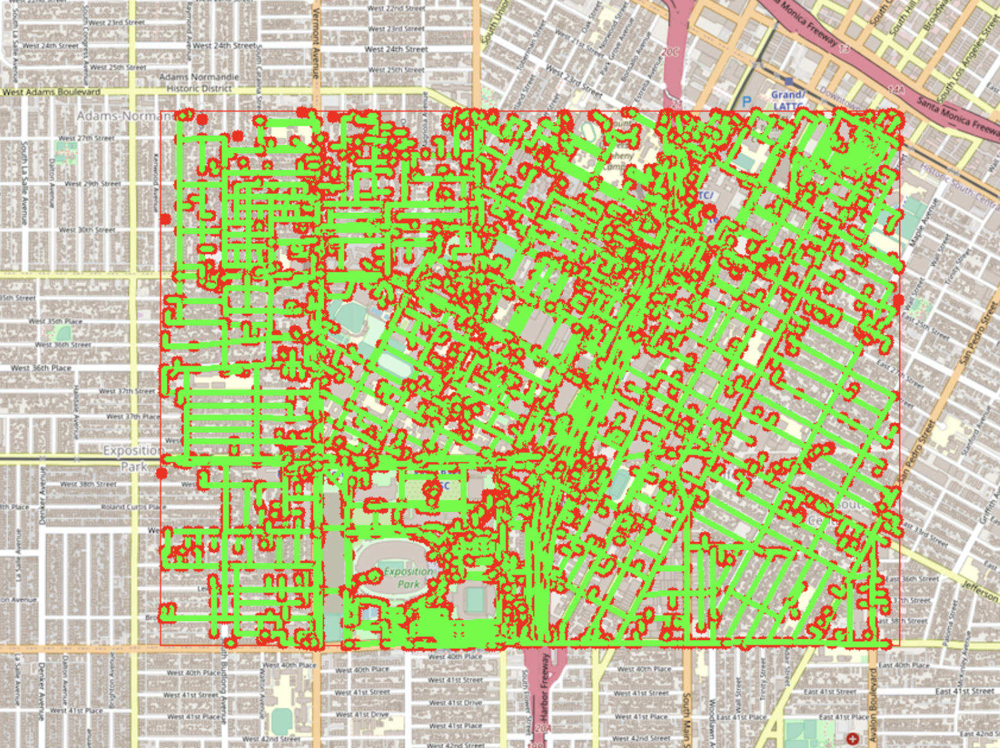</p>


2.
```shell

**************************************************************
* 7. Cycle Detection                                          
**************************************************************

Please input the left bound longitude(between -118.320 and -118.250):-118.290
Please input the right bound longitude(between -118.320 and -118.250):-118.289
Please input the upper bound latitude(between 34.000 and 34.040):34.030
Please input the lower bound latitude(between 34.000 and 34.040):34.020
*************************Results******************************
there exist no cycle in the subgraph 
**************************************************************
Time taken by function: 0 ms

```
<p align="center">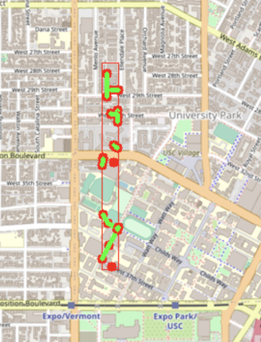</p>

3.
```shell

**************************************************************
* 7. Cycle Detection                                          
**************************************************************

Please input the left bound longitude(between -118.320 and -118.250):-118.292
Please input the right bound longitude(between -118.320 and -118.250):-118.285
Please input the upper bound latitude(between 34.000 and 34.040):34.035
Please input the lower bound latitude(between 34.000 and 34.040):34.015
*************************Results******************************
there exists a cycle in the subgraph 
**************************************************************
Time taken by function: 0 ms

```

<p align="center">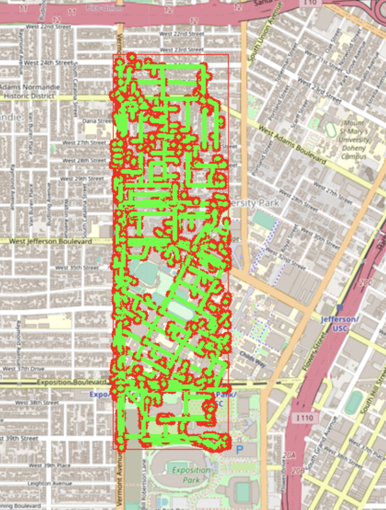</p>

4.
```shell

**************************************************************
* 7. Cycle Detection                                          
**************************************************************

Please input the left bound longitude(between -118.320 and -118.250):-118.292
Please input the right bound longitude(between -118.320 and -118.250):-118.290
Please input the upper bound latitude(between 34.000 and 34.040):34.035
Please input the lower bound latitude(between 34.000 and 34.040):34.030
*************************Results******************************
there exists a cycle in the subgraph 
**************************************************************
Time taken by function: 0 ms

```

<p align="center">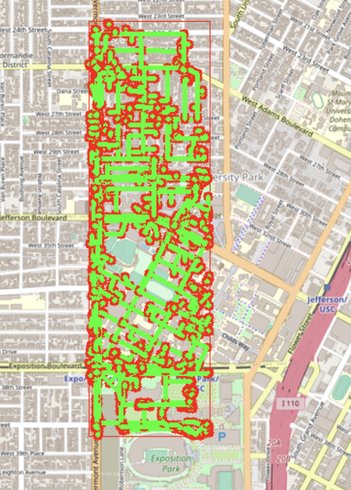</p>

5.
```shell

**************************************************************
* 7. Cycle Detection                                          
**************************************************************

Please input the left bound longitude(between -118.320 and -118.250):-118.290
Please input the right bound longitude(between -118.320 and -118.250):-118.270
Please input the upper bound latitude(between 34.000 and 34.040):34.030
Please input the lower bound latitude(between 34.000 and 34.040):34.020
*************************Results******************************
there exists a cycle in the subgraph 
**************************************************************
Time taken by function: 0 ms

```
<p align="center">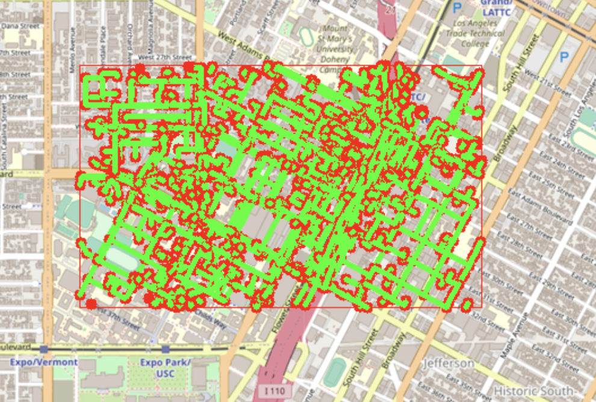</p>

---

### Item 8 Topological Sort

In the function `DeliveringTrojan`, a recursive function `topology_helper` is called with the following arguments:

1. string `cur`: the root vertex of a sub-tree.
2. unordered_map<string, vector<string>> `edges`: to store the graph as an adjacency list.
3. unordered_map<string, bool> `visited`: to mark visited vertices.
4. vector<string>& `result`: to store the topological sort result.

The recursive function `topology_helper` performs a DFS on the graph, marking each vertex as visited as it is encountered. 
When a vertex has no unvisited neighbors, it is pushed onto the `result vector`.

The `result vector` will then contain the topological sort of the graph.

#### Time complexity

O( E+V ), where E is the number of edges and V is the number of vertices.

### Input

<p align="left">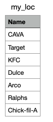</p>

1. Case 1:

### Input

<p align="left">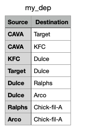</p>

### Output:

```shell

**************************************************************
* 8. Topological Sort                                         
**************************************************************

Please input the locations filename:my_loc.csv
Please input the dependencies filename:my_dep.csv
CAVA KFC Target Dulce Arco Ralphs Chick-fil-A 
*************************Results******************************
Topological Sorting Results:
CAVA
KFC
Target
Dulce
Arco
Ralphs
Chick-fil-A
**************************************************************
Time taken by function: 0 ms

```

<p align="center">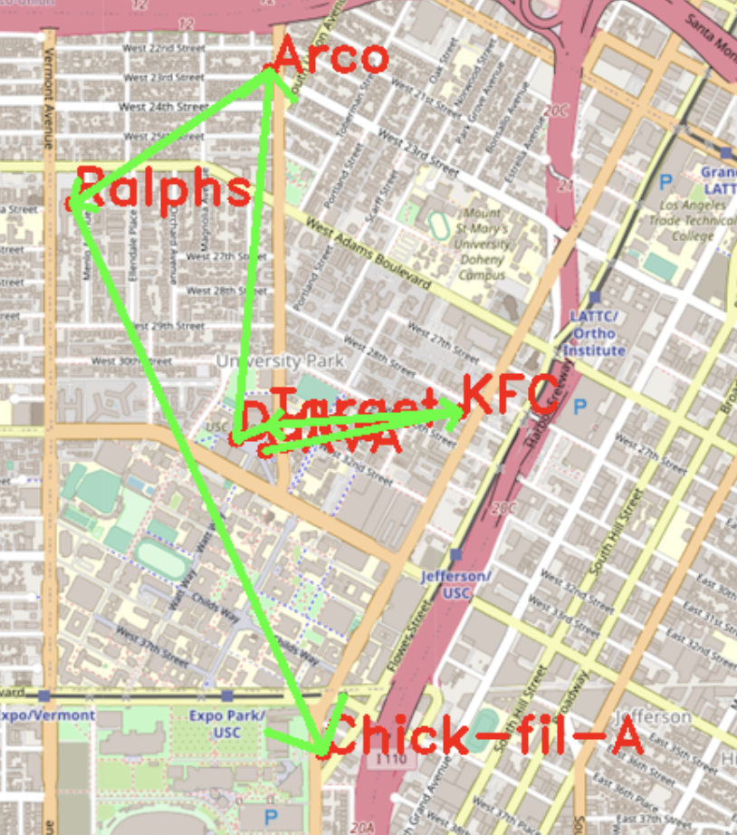</p>

2. Case 2:

### Input:

<p align="left">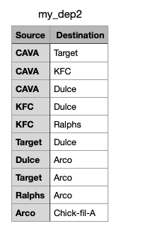</p>

#### Output

```shell

**************************************************************
* 8. Topological Sort                                         
**************************************************************

Please input the locations filename:my_loc.csv
Please input the dependencies filename:my_dep2.csv
CAVA KFC Ralphs Target Dulce Arco Chick-fil-A 
*************************Results******************************
Topological Sorting Results:
CAVA
KFC
Ralphs
Target
Dulce
Arco
Chick-fil-A
**************************************************************
Time taken by function: 0 ms

```

<p align="center"></p>

---

### Item 9 The Traveling Trojan Problem 
+ Brute-force

In the function `TravelingTrojan_Brute_force`, the recursive function `greedyHelper` is called to generate all combinations of paths of given `location_ids`.

The function `CalculatePathLength` is then used to calculate the length of each path.

If the length of a path is shorter than the current shortest path length, the path is added in a `vector` and the current shortest distance is updated.

Finally, the function returns a `pair` which is shortest path length and a `vector` to store each path which have been updated.


#### Time complexity

O( n! ), where n is the number of given location_ids.

+ Brute-force enhanced with early backtracking

To enhance Brute-force with early backtracking, when the recursive function `backtrackingHelper` selects the next candidate node, if the distance of the new path is longer than the current shortest path distance, the candidate will be skipped.


#### Time complexity

O( n! ), where n is the number of given location_ids.

+ 2-opt


Instead of using a recursive function, the 2-opt method randomly selects two nodes from the given `location_ids` and repeatedly swaps the path between them for a specified number of iterations (in this case, 1000).

While this approach can yield the shortest distance, it does not always produce the optimal path.


#### Time complexity

O( V^2 * M ), where V is the number of vertices and M is a number of iterations.

+ Comparison

| Number of nodes| Brute-force| Brute-force enhanced with early backtracking|2-opt Heuristic|
|----------|-----------|----------|----------|
|    7     |     69 ms |   23 ms  |   10 ms  |
|    8     |    620 ms |  104 ms  |   12 ms  |
|    9     |   6019 ms |  649 ms  |   14 ms  |
|   10     |  65222 ms | 6745 ms  |   14 ms  |
|   11     | 757763 ms |18239 ms  |   16 ms  |

```shell
**************************************************************
* 9. Traveling salesman problem                              
**************************************************************

In this task, we will select N random points on the map and you need to find the path to travel these points and back to the start point.

Please input the number of the places:10
"21098478","6818460799","7307753698","7384983935","8410586478","1614656036","6814990156","1717922306","6820935914","2296235897",
Calculating ...
*************************Results******************************
TravelingTrojan_Brute_force
"7307753698","6820935914","6814990156","7384983935","1717922306","8410586478","21098478","1614656036","2296235897","6818460799","7307753698",
The distance of the path is:9.21285 miles
**************************************************************
You could find your animation at src/lib/output0.avi.          
Time taken by function: 59688 ms

Calculating ...
*************************Results******************************
TravelingTrojan_Backtracking
"7307753698","6820935914","6814990156","7384983935","1717922306","8410586478","21098478","1614656036","2296235897","6818460799","7307753698",
The distance of the path is:9.21285 miles
**************************************************************
You could find your animation at src/lib/output0_backtracking.avi.
Time taken by function: 2741 ms

Calculating ...
*************************Results******************************
TravelingTrojan_2opt
"21098478","1614656036","2296235897","6818460799","7307753698","6820935914","6814990156","7384983935","1717922306","8410586478","21098478",
The distance of the path is:9.21285 miles
**************************************************************
You could find your animation at src/lib/output0_2opt.avi.     
Time taken by function: 14 ms

```
+ optimal solution to 2-opt solution

| Backtracking Path| "7307753698","6820935914","6814990156","7384983935","1717922306","8410586478","21098478","1614656036","2296235897","6818460799","7307753698" |
|----------|-----------|
|    2-opt  Path   | "21098478","1614656036","2296235897","6818460799","7307753698","6820935914","6814990156","7384983935","1717922306","8410586478","21098478"   |


---

### Item 10 Find Nearby

The `FindNearby` function utilizes breadth-first search (BFS) to search for candidates near a given name. 
The function selects candidates whose distance from the given name is less than the given `radius` and the attribute of the candidate matches given attribute.
Then, a while-loop is used to generate a `vector` of nearby locations in order of increasing distance, from closest to farthest.


#### Time complexity

O( M*N ), where N is the number of nodes and M is the number of attrubutes in the nodes.

#### Output
```shell

**************************************************************
* 10. Find Nearby                                              
**************************************************************

Please input the attribute:bank
Please input the locations:Ralphs
Please input radius r:10
Please input number k:10
*************************Results******************************
Find Nearby Results:
1 USC Credit Union
2 Bank of America
3 Chase
**************************************************************
Time taken by function: 126 ms

```

<p align="center">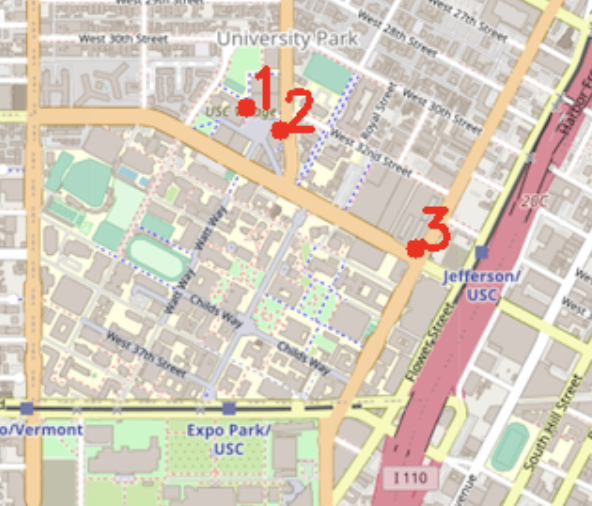</p>

---
### Item 11 TrojanPath

The `TrojanPath` function employs a backtracking approach to generate all possible combinations of the given `location names`. 
The function then uses Dijkstra's algorithm to find the shortest path among these combinations. 
In addition, the TrojanPath function utilizes dynamic programming to record the path between each node, thereby reducing the overall cost of the algorithm.

Finally, the function returns the `result` with the shortest path.

#### Time complexity

O( n! * ( E * log V ) ), where n is the number of given location names, E is the number of edges, and V is the number of vertices.

#### Output
```shell

**************************************************************
* 11. Shortest Path to Visit all Nodes                        
**************************************************************

Please input the locations filename:

*************************Results******************************
"2578244375","4380040154","4380040158","4380040167","6805802087","8410938469","6813416131","7645318201","6813416130","6813416129","123318563","452688940","6816193777","123408705","6816193774","452688933","452688931","123230412","6816193770","6787470576","4015442011","6816193692","6816193693","6816193694","3398621886","3398621887","6816193695","5690152756","6804883324","3398621888","6813416123","6813416171","6807536647","6807320427","6807536642","6813416166","7882624618","7200139036","122814440","6813416163","7477947679","7298150111","6787803640","6807554573","2613117890","4835551096","4835551101","4835551097","4835551100","3088547686","4835551100","4835551099","4835551098","6813565307","6813565306","6813565305","6813565295","6813565296","3402814832","4835551107","6813379403","6813379533","3402814831","6813379501","3402810298","6813565327","3398574883","6813379494","6813379495","6813379544","6813379545","6813379536","6813379546","6813379547","6814916522","6814916523","1732243620","4015372469","4015372463","6819179749","1732243544","6813405275","348121996","348121864","6813405280","1472141024","6813411590","216155217","6813411589","1837212103","1837212101","6814916516","6814916515","6820935910","4547476733",
The distance of the path is:1.86368 miles
Time taken by function: 350 ms


```

<p align="center">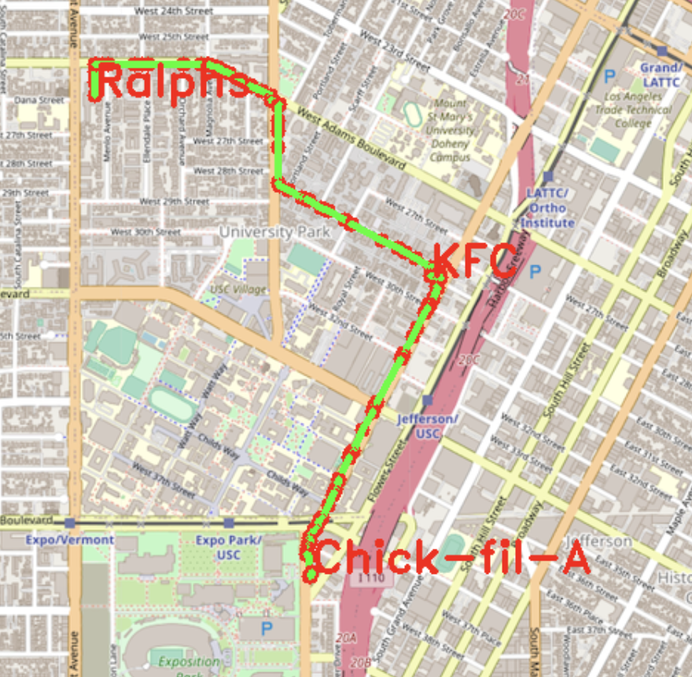</p>

---
### Item 12 Check the existence of the path with a constrained gas tank

The `Queries` function calls the `queryHelper` function to utilize Dijkstra's algorithm with `priority queue`. 
During the Dijkstra's algorithm, the function not only checks whether the neighbor of the current vertex has been visited, but also checks whether the given amount of gas in the tank is sufficient to reach that neighbor. 
Once all vertices have been visited, the function returns the shortest path that can be traveled with the given amount of gas in the tank.

#### Time complexity

O( E * logV ), where E is the number of edges and V is the number of vertices.

#### Output
```shell

**************************************************************
* 12. Check Exist of Path with Constrain                      
**************************************************************

Please input the start location:Ralphs
Please input the destination:Target
Please input the volumn of the gas tank:0.05 
More Query? (y/n)y
Please input the start location:KFC
Please input the destination:Target
Please input the volumn of the gas tank:0.1
More Query? (y/n)n
*************************Results******************************
From Ralphs to Target with 0.05 gallons of gas tank: Yes
From KFC to Target with 0.1 gallons of gas tank: Yes
**************************************************************
Time taken by function: 88 ms


```

<p align="center">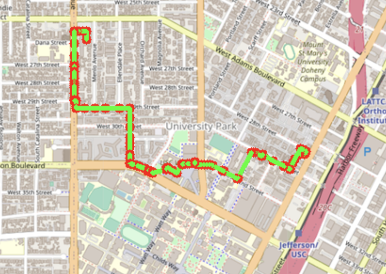</p>

---

### Dynamic and animated UI

By using ncurses, I implement all function in original project in a dynamic and animated UI.
I present some function as sample below:

+ Landing page:

<p align="center">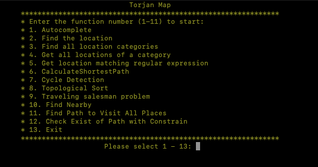</p>

+ Item 6 Calculate Shortest Path :

<p align="center">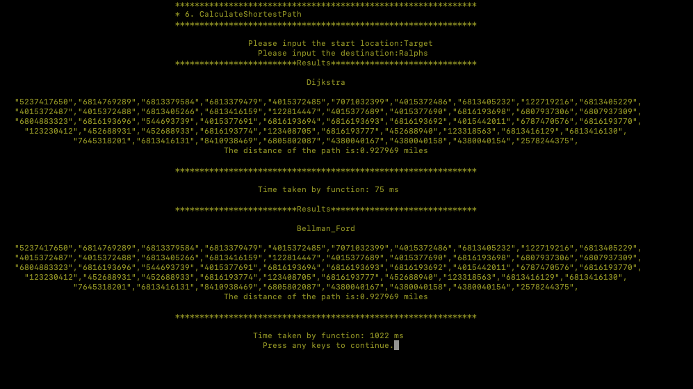</p>

+ Item 9 The Traveling Trojan Problem:

<p align="center">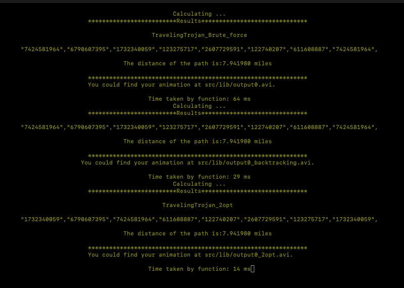</p>

+ Item 11: Find the Shortest Path to Visit All locations 

<p align="center">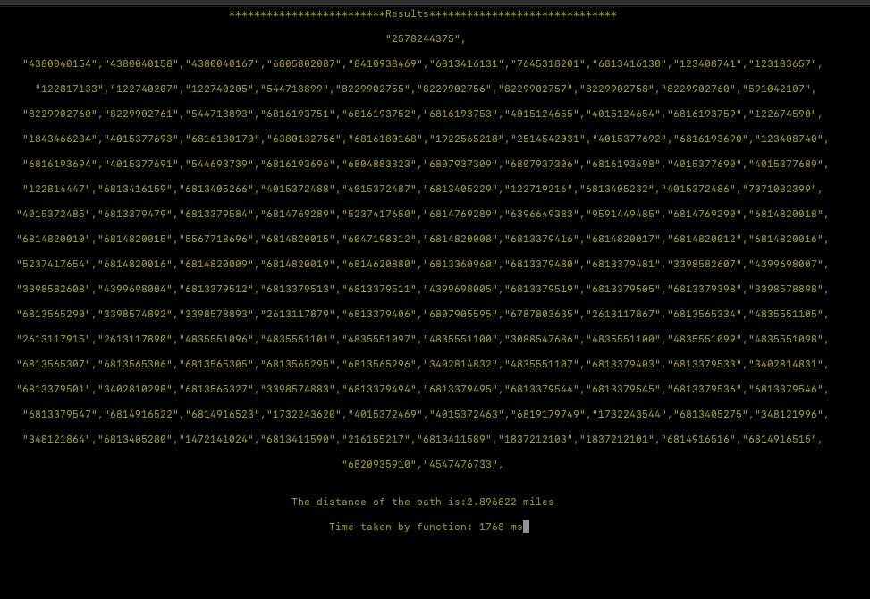</p>


## Conclusion

The project has allowed me to apply the data structures and algorithms that I have learned in class to real-world problems. 
By implementing various algorithms using different data structures, I have gained a deeper understanding of how these structures work in practice. 
Moreover, the project has shown me how graph algorithms can be used to represent and analyze geographical maps.

Additionally, the class and project have helped me develop my skills in analyzing time complexity, as I was able to see firsthand how the choice of algorithm affects the real-time cost of implementing a feature.

Overall, the class and project have provided me with a comprehensive understanding of various algorithms and data structures, how to implement them effectively, and their real-world applications.


